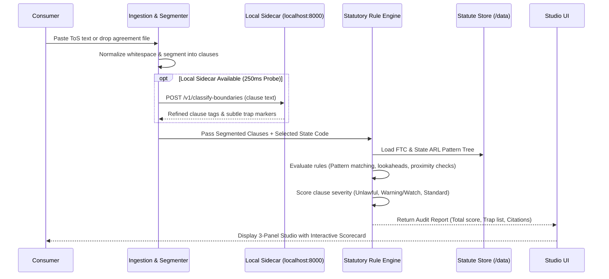

# Architecture Specification: BillOfRightsBot for Subscriptions

**One-liner:** Paste or upload a subscription agreement or Terms of Service (ToS). Get a 100% local-first, statute-grounded breakdown flagging auto-renewal traps, asymmetric cancellation hurdles, and deceptive negative options against the FTC's "Click-to-Cancel" Rule and state auto-renewal statutes—with instant statutory dispute and cancellation notices.

---

## 1. System Overview & Philosophy

### 1.1 Core Principles (The knowthankyew Ethos)
1. **100% Local-First & Air-Gapped by Design:** Zero terms text, metadata, or consumer telemetry ever leaves the user's local machine. All parsing, evaluation, and document generation execute entirely within the local process and memory. Outbound network connectivity is disabled by default via strict Content Security Policy (CSP).
2. **Statute-Grounded Truth:** Every flagged clause is directly tied to a specific federal or state statute (e.g., FTC Negative Option Rule 16 CFR Part 425, California Automatic Renewal Law Cal. Bus. & Prof. Code §§ 17600–17606, New York Gen. Bus. Law § 527-a, ROSCA 15 U.S.C. §§ 8401–8405). No hallucinated legal theories, unverified AI assertions, or generic platitudes without statutory lineage.
3. **Deterministic Standalone Operation (LLM-Optional):** Fully capable standalone using deterministic regular expressions, structural heading heuristics, and legal domain keyword clustering. If a local model sidecar (such as `event-driven-ftaas` or Ollama / llama.cpp at `http://localhost:8000`) is running, BillOfRightsBot silently enhances nuance detection without errors, timeouts, or UI warnings when absent.
4. **Actionable Consumer Leverage:** Goes beyond passive highlighting: automatically drafts formal statutory cancellation notices, pre-formatted FTC violation complaints, and refund clawback demands invoking statutory "unconditional gift" protections.
5. **Ephemerality & Instant Purge:** A dedicated "Burn Local Data" action immediately wipes all memory, parsed state, active DOM nodes, and session storage.
6. **Day-1 Accessibility (WCAG AA):** High-contrast obsidian design tokens, semantic HTML5 landmarks, screen-reader live regions, full keyboard operability, and reduced-motion support built into every component.

### 1.2 System Architecture Diagram

```mermaid
flowchart TD
    subgraph Client ["Client Browser Runtime (Local-First Studio)"]
        UI["BillOfRightsBot Studio UI"]
        Ingest["Document Ingestion & Text Normalizer\n(Paste, TXT, HTML, PDF/DOCX)"]
        Segmenter["Clause Segmentation Engine\n(Heading & Boundary Tokenizer)"]
        RuleEngine["Statute Rule Evaluation Engine\n(Deterministic Regex & Heuristics)"]
        DisputeGen["Statutory Remedy & Notice Generator\n(Click-to-Cancel, Refund Clawback, FTC Complaint)"]
        BurnAction["'Burn Local Data' Action\n(In-Memory Zeroization & Flush)"]
    end

    subgraph Data ["Local Statute Knowledge Store (/data)"]
        FTCRules["FTC Click-to-Cancel & ROSCA\n(16 CFR Part 425 / 15 U.S.C. 8401)"]
        StateRules["State ARL Compendium\n(CA, NY, IL, CO, TX, DE, etc.)"]
    end

    subgraph OptionalSidecar ["Optional Local Inference Sidecar (Zero External Calls)"]
        Sidecar["event-driven-ftaas / Local LLM\n(localhost:8000 / localhost:11434)"]
    end

    Ingest -->|Normalized Chunks| Segmenter
    Segmenter -->|Candidate Clauses| RuleEngine
    Segmenter -.->|Optional Non-Blocking Semantic Check (250ms)| Sidecar
    FTCRules --> RuleEngine
    StateRules --> RuleEngine
    RuleEngine -->|Evaluated Traps & Citations| UI
    UI --> DisputeGen
    DisputeGen -->|Print-to-PDF / Copy Notice| UI
    BurnAction -->|Zero State & Purge Memory| UI
```

---

## 2. Ingestion & Document Pre-Processing Pipeline

Terms of Service and subscription agreements vary widely in format: pasted text from web portals, raw `.txt` files, exported HTML agreements, and PDF contract documents. The ingestion layer converts raw inputs into normalized, structured text chunks while preserving clause numbering, typography emphasis, and section markers.

### 2.1 Supported Ingestion Formats
- **Direct Paste / Plain Text:** Normalized UTF-8 text delivered via client-side input.
- **HTML Terms of Service:** In-process DOM/HTML parser strips scripts, ads, and navigational noise while retaining semantic headings (`<h1>`-`<h6>`), lists (`<ol>`, `<ul>`), and emphasis elements (`<strong>`, `<b>`, uppercase headers).
- **PDF Documents (`.pdf`):** In-browser local extraction (e.g. via local PDF.js runtime or local parser) extracting sequential text runs and font weight indicators for heading detection, with zero server uploads.
- **Word / Rich Text (`.docx`, `.rtf`, `.md`):** Local client-side unzip/text parser extracting paragraphs and heading styles.

### 2.2 Ingestion Normalization Rules
1. **Whitespace & Control Standardization:** Normalizes smart quotes, non-breaking spaces (`\u00A0`), em-dashes, and multiple whitespace sequences.
2. **Boundary Anchoring:** Identifies and tags section delimiters (`Section 4`, `Paragraph 8(b)`, `Article III`, `AUTOMATIC RENEWAL TERMS:`, `CANCELLATION POLICY:`).
3. **Pre-scrubbing Sensitive Markers:** Detects and flags potential consumer account numbers or user-identifying info for automatic masking prior to local evaluation.

---

## 3. Subscription Trap Classification & Statutory Rule Engine

### 3.1 Processing Pipeline Flow



### 3.2 Core Subscription Trap Taxonomy (Statutory Mapping)

BillOfRightsBot targets eight distinct categories of deceptive subscription practices, each mapped to specific statutory citations:

| Trap ID | Trap Category | Target Practice & Deceptive Pattern | Grounded Statutory Citation |
| :--- | :--- | :--- | :--- |
| **TRAP-01** | **Asymmetric Cancellation ("Click-to-Cancel" Violation)** | Requiring consumers who enrolled online to cancel by phone, mail, in-person, or through complex customer service gauntlets. | **FTC Negative Option Rule (16 CFR § 425.6); Cal. Bus. & Prof. Code § 17602(c); N.Y. Gen. Bus. Law § 527-a; ROSCA (15 U.S.C. § 8403)** |
| **TRAP-02** | **Buried / Inconspicuous Auto-Renewal** | Hiding recurring billing terms in voluminous boilerplate, tiny font sizes, low contrast, or beneath the fold without clear visual prominence. | **FTC 16 CFR § 425.3; Cal. Bus. & Prof. Code § 17602(a)(1); 815 ILCS 601/10; Colo. Rev. Stat. § 6-1-732** |
| **TRAP-03** | **Absence of Express Affirmative Consent** | Combining acceptance of general ToS with consent to recurring charges, pre-checked boxes, or failing to obtain standalone consent for auto-renewal. | **FTC 16 CFR § 425.4; Cal. Bus. & Prof. Code § 17602(a)(2); Del. Code Ann. tit. 6, § 2734** |
| **TRAP-04** | **Deceptive Free-Trial-to-Paid Conversion** | Enrolling users in a trial with continuous billing upon expiration without explicit prior reminder notice or clear cancellation deadline disclosure. | **FTC 16 CFR § 425.3(a)(3); Cal. Bus. & Prof. Code § 17602(b); N.Y. Gen. Bus. Law § 527-a; Va. Code Ann. § 59.1-207.45** |
| **TRAP-05** | **Pre-Renewal Window & Lock-in Traps** | Demanding notice 30–60 days in advance of renewal without sending a mandatory statutory renewal reminder notice. | **Cal. Bus. & Prof. Code § 17602(a)(4); N.Y. Gen. Bus. Law § 527-a(2); 815 ILCS 601/10; Colo. Rev. Stat. § 6-1-732** |
| **TRAP-06** | **Retention Mazes ("Saves Gauntlet")** | Forcing users through required retention surveys, multi-step counter-offers ("saves"), or obstructive delays before executing cancellation. | **FTC 16 CFR § 425.6(b) (Prohibition of unsolicited retention pitches without prior consent)** |
| **TRAP-07** | **Unilateral Price Escalation Without Re-Consent** | Reserving the right to increase recurring subscription fees automatically without advance notice and an opportunity to cancel before the charge occurs. | **FTC 16 CFR § 425.5; Cal. Bus. & Prof. Code § 17602(d); 15 U.S.C. § 8403** |
| **TRAP-08** | **Unlawful Billing & Concealed "Unconditional Gift"** | Charging consumers under non-compliant renewal terms and failing to disclose that unauthorized goods/services constitute an unconditional gift. | **Cal. Bus. & Prof. Code § 17603 (Statutory unconditional gift rule & restitution remedy)** |

---

## 4. Data Contracts & Rule Schema Specifications

All statute definitions and rule sets reside in versioned, human-readable JSON schemas under `/data`.

### 4.1 Statute Rule Definition Schema (`/data/statutes/{jurisdiction}.json`)

```json
{
  "$schema": "http://json-schema.org/draft-07/schema#",
  "jurisdictionCode": "FTC",
  "jurisdictionName": "Federal Trade Commission",
  "statuteTitle": "Negative Option Rule (Click-to-Cancel)",
  "codification": "16 CFR Part 425",
  "lastAudited": "2026-09-01",
  "officialSourceUrl": "https://www.ftc.gov/legal-library/browse/rules/negative-option-rule",
  "rules": [
    {
      "id": "FTC-CTC-01",
      "category": "AsymmetricCancellation",
      "trapName": "Click-to-Cancel Asymmetric Cancellation Hurdle",
      "severity": "Unlawful",
      "statutoryCitation": "16 CFR § 425.6(a)",
      "statuteSummary": "Requires sellers to provide a cancellation mechanism that is at least as simple as the mechanism used to initiate the negative option feature. If the consumer signed up online, they must be allowed to cancel online in the same medium without interactive hurdles or mandatory phone calls.",
      "triggerPatterns": [
        "(?:must|required\\s+to|only\\s+way\\s+to)\\s+call\\s+(?:customer\\s+service|support|1-800|toll-free|representative)",
        "cancellations?\\s+(?:cannot|not\\s+accepted)\\s+(?:online|by\\s+email|through\\s+account)",
        "(?:to|prior\\s+to)\\s+cancel(?:ling)?.*(?:speak|chat|call|contact)\\s+(?:a|with\\s+a)\\s+(?:representative|agent|specialist|retention)"
      ],
      "negativeExceptions": [
        "or\\s+cancel\\s+online\\s+at\\s+any\\s+time",
        "can\\s+cancel\\s+via\\s+your\\s+account\\s+settings"
      ],
      "disputeTemplate": "Under 16 CFR § 425.6 (FTC Click-to-Cancel Rule), cancellation mechanisms must be at least as simple as the method used to subscribe. Requiring phone contact or representative interaction for an online subscription violates federal law."
    }
  ]
}
```

### 4.2 Audit Evaluation Output Schema (`AuditReport`)

```json
{
  "auditId": "8f3b2a10-482a-43d9-95e2-047b4e3a8901",
  "timestamp": "2026-09-17T11:00:00Z",
  "selectedJurisdiction": "CA",
  "agreementName": "Example Streaming Service Terms of Service",
  "summary": {
    "totalClausesEvaluated": 32,
    "unlawfulTrapCount": 3,
    "warningWatchCount": 2,
    "compliantCount": 27,
    "overallRiskRating": "High",
    "unconditionalGiftRemedyTriggered": true
  },
  "flaggedClauses": [
    {
      "clauseId": "clause-09",
      "rawText": "To cancel your auto-renewing annual subscription, you must call our customer care hotline at 1-800-555-0199 Monday through Friday between 9 AM and 5 PM EST at least 30 days prior to your renewal date.",
      "trapCategory": "AsymmetricCancellation",
      "severity": "Unlawful",
      "matchedRuleId": "FTC-CTC-01",
      "statutoryCitation": "16 CFR § 425.6 & Cal. Bus. & Prof. Code § 17602(c)",
      "violationAnalysis": "Mandates telephonic cancellation during restricted business hours with a 30-day advance lock-in window for an online subscription. Directly violates FTC Click-to-Cancel and California ARL mandatory immediate online cancellation provisions.",
      "statutoryRemedy": "Demand immediate online cancellation without penalty. In California, any goods or services provided following non-compliant continuous service are deemed an unconditional gift under Cal. Bus. & Prof. Code § 17603."
    }
  ]
}
```

---

## 5. Graceful Local Sidecar Enhancement (`event-driven-ftaas` / Local LLM)

BillOfRightsBot works autonomously with 100% deterministic regex pattern trees. However, modern deceptive design often employs obfuscated or euphemistic language (e.g., "to modify your service status, our concierge team is on standby").

### 5.1 Non-Blocking Local Sidecar Integration
- **Probe Protocol:** On audit execution, client makes a 250ms fetch to `http://localhost:8000/health` (or `http://localhost:11434/api/version` for Ollama).
- **Graceful Degradation:** If unreachable or rejected, execution continues instantaneously using the deterministic engine. No error toast, warning, or degraded UX is shown.
- **Semantic Enhancement:** When active, the sidecar analyzes clauses flagged as borderline (`Watch`) to check for deceptive semantic framing or implicit retention mazes.
- **Hard Privacy Rule:** Outbound network calls to external URLs, analytics servers, or remote cloud AI endpoints are strictly prohibited. The sidecar endpoint must resolve strictly to loopback (`localhost` or `127.0.0.1`).

---

## 6. The 3-Panel Studio User Experience & Accessibility

BillOfRightsBot features a cohesive 3-panel consumer defense studio inspired by the grounded clarity of `knowthankyew` tools:

```
┌────────────────────────────────────────────────────────────────────────────────────────────────┐
│ ⚖️ BillOfRightsBot   [● Zero Outbound Traffic]   [📚 Grounded in FTC & State ARL]   [🔥 Burn Data] │
├─────────────────────────┬────────────────────────────────────────┬─────────────────────────────┤
│ GROUNDED STATUTES       │ AGREEMENT AUDIT WORKSPACE              │ DEFENSE & REMEDY STUDIO     │
│ (Left Rail)             │ (Center Workspace)                     │ (Right Rail)                │
│                         │                                        │                             │
│ • FTC Negative Option   │ • Input Dropzone & Paste Box           │ • Tabbed Action Generators: │
│   Rule (16 CFR Part 425)│ • Audit Summary Scorecard:             │   1. Immediate Click-to-    │
│ • Federal ROSCA         │   - 🔴 Unlawful Traps                  │      Cancel Demand          │
│   (15 U.S.C. § 8401)    │   - 🟡 Warning / Watch Clauses         │   2. FTC Violation Report   │
│ • California ARL        │   - 🟢 Standard / Compliant Terms      │   3. Unconditional Gift     │
│   (Cal. Bus. & Prof.)   │ • Interactive Clause Card Grid         │      Refund Clawback Notice │
│ • New York GBL § 527-a  │   - Raw Clause Text                    │                             │
│ • Illinois Auto-Renewal │   - Statutory Citation Tag             │ • 1-Click Copy Notice       │
│ • Colorado C.R.S. 6-1   │   - Plain-English Violation Reason     │ • Print to PDF for Certified│
│ • Jurisdiction Selector │   - Statutory Remedy Badge             │   Mail with Proof of Notice │
└─────────────────────────┴────────────────────────────────────────┴─────────────────────────────┘
```

### 6.1 Left Rail: Grounded Statutes & Jurisdictions
- Displays the verified statutory canon with active regulation summaries.
- Clicking any statutory reference opens a modal displaying the exact legal text and legislative effective dates.
- Jurisdiction selector allows switching between Federal baseline only or applying specific state ARL standards (California, New York, Illinois, Colorado, Texas, Delaware, etc.).

### 6.2 Center Workspace: Agreement Audit & Clause Scorecard
- Direct drag-and-drop or paste area with sample agreements (e.g., *Gym Membership Phone-Trap*, *Streaming Service Hidden Renewal*, *SaaS Retention Maze*).
- Visual scorecard displaying risk metrics, total traps detected, and statutory non-compliance level.
- Filterable clause cards by severity (Unlawful, Watch, Standard) with highlighted trigger sentences.

### 6.3 Right Rail: Defense & Remedy Studio
- **Click-to-Cancel Statutory Notice:** Formally invokes 16 CFR § 425.6 and state online cancellation statutes, instructing the vendor that their cancellation barriers violate law and ordering immediate subscription cessation.
- **FTC & State AG Violation Complaint Draft:** Pre-formatted consumer complaint detailing specific statutory violations, ready to submit directly to `reportfraud.ftc.gov` or state Attorneys General.
- **Unconditional Gift Refund Demand:** Invokes California Cal. Bus. & Prof. Code § 17603 or equivalent state laws to demand full reimbursement of unlawful charges, declaring all post-renewal services an unconditional gift.
- 1-click clipboard copy and unbranded, print-ready CSS (`@media print`) optimized for USPS Certified Mail.

### 6.4 Ephemeral "Burn Local Data" Action
- Instantly purges all in-memory text, parsed clause tokens, active form inputs, and state variables.
- Re-initializes the DOM to the initial blank state.

### 6.5 Accessibility Standards (Day 1)
- **High-Contrast Obsidian Palette:** Contrast ratios exceeding WCAG AAA (7:1) for body text and AA (4.5:1) for all interactive controls.
- **Keyboard Navigation:** Logical tab flow across rails, trap cards, and remedy actions (`Tab`, `Shift+Tab`, `Enter`, `Space`, `Esc`).
- **Screen Reader Announcements:** `aria-live="polite"` status announcements for audit completion, trap tally updates, and copy actions.
- **Motion Preferences:** `@media (prefers-reduced-motion: reduce)` disables all animations and transitions.

---

## 7. Recommended Technology Stack & Repository Layout

### 7.1 Technology Stack
- **Frontend / Studio Runtime:** TypeScript + Vite + Vanilla CSS (Custom Obsidian Design Tokens).
- **Core Engine:** TypeScript pure domain logic (deterministic regular expressions, heading tokenizer, statutory rule evaluator). Zero external npm network dependencies.
- **Document Ingestion:** In-process text parsing and client-side sanitization.
- **Testing Suite:** Vitest for deterministic unit rule tests + Playwright for end-to-end user workflows and local data zeroization tests.

### 7.2 Repository Layout

```
bill-of-rights-bot/
├── ARCHITECTURE.md                  # Comprehensive architectural specification (this file)
├── index.html                       # Strict CSP HTML shell with zero external network scripts
├── vite.config.ts                   # Vite development and bundle configuration
├── package.json                     # Minimal dependencies (TypeScript, Vite, Vitest)
├── tsconfig.json                    # Strict TypeScript configuration
├── data/
│   ├── statutes/
│   │   ├── ftc.json                 # FTC Negative Option Rule (16 CFR Part 425) & ROSCA
│   │   ├── california.json          # Cal. Bus. & Prof. Code §§ 17600–17606 (AB 390 / AB 2863)
│   │   ├── new-york.json            # N.Y. Gen. Bus. Law § 527-a
│   │   ├── illinois.json            # 815 ILCS 601/ (Automatic Contract Renewal Act)
│   │   ├── colorado.json            # Colo. Rev. Stat. § 6-1-732
│   │   └── delaware.json            # Del. Code Ann. tit. 6, § 2734
│   └── samples/
│       ├── gym-contract.txt         # Sample ToS with phone-only cancellation trap
│       ├── streaming-service.txt    # Sample ToS with hidden renewal & trial conversion
│       └── saas-agreement.txt       # Sample ToS with saves maze & unilateral price hike
├── src/
│   ├── contracts/                   # Strongly typed data models
│   │   ├── statute.ts               # Statute rule schemas and jurisdiction types
│   │   ├── clause.ts                # Clause segmentation and evaluation types
│   │   ├── audit.ts                 # Audit report and scorecard metrics
│   │   └── notice.ts                # Statutory dispute notice types
│   ├── core/                        # Pure domain logic (100% deterministic, zero network)
│   │   ├── normalizer.ts            # Text normalization and delimiter anchoring
│   │   ├── segmenter.ts             # Heading and boundary clause tokenizer
│   │   ├── rule-engine.ts           # Statutory evaluation engine against rule trees
│   │   ├── sidecar-client.ts        # Non-blocking probe to localhost:8000 (optional)
│   │   └── notice-generator.ts      # Statutory dispute and cancellation letter drafts
│   ├── components/                  # Accessible Studio UI components
│   │   ├── Header.tsx               # Brand, privacy badge, state selector, burn button
│   │   ├── StatuteRail.tsx          # Left rail: active grounded statutory references
│   │   ├── StatuteModal.tsx         # Detailed inspector modal for statutory legal text
│   │   ├── AgreementWorkspace.tsx   # Center workspace: dropzone, text input & samples
│   │   ├── Scorecard.tsx            # Visual risk metrics and trap counter
│   │   ├── ClauseCardGrid.tsx       # Filterable clause cards with statutory citations
│   │   └── RemedyStudio.tsx         # Right rail: statutory notices, copy & print-to-PDF
│   ├── styles/
│   │   └── index.css                # Obsidian design system, WCAG AA tokens & print CSS
│   ├── App.tsx                      # Root Studio application state
│   └── main.tsx                     # Application bootstrap
└── tests/
    ├── unit/
    │   ├── normalizer.test.ts       # Text cleaning and boundary anchoring tests
    │   ├── segmenter.test.ts        # Clause segmentation accuracy tests
    │   ├── rule-engine.test.ts      # Statutory rule trigger tests (FTC & State ARL)
    │   └── notice-generator.test.ts # Legal notice drafting tests
    └── e2e/
        └── studio-workflow.spec.ts  # End-to-end Playwright workflow & purge verification
```

---

## 8. Verification & Test Strategy

1. **Deterministic Rule Verification (Vitest):**
   - Every rule in `data/statutes/*.json` has corresponding positive and negative test cases verifying pattern matching, false-positive resistance, and citation accuracy.
   - Comprehensive test fixtures reflecting real-world predatory subscription clauses from gyms, cloud services, streaming apps, and consumer publications.
2. **Sidecar Graceful Degradation Testing:**
   - Unit tests confirm that if the sidecar is offline or returns an error, the audit completes deterministically in < 15ms without raising exceptions.
3. **Local Data Zeroization (Burn Data) Verification:**
   - E2E tests verify that invoking "Burn Local Data" clears all textarea content, resets the clause grid, zeroizes in-memory audit results, and returns the application to its pristine initial state.
4. **Air-Gap Verification:**
   - Network interception tests confirm that 0 external network requests are dispatched during full ingestion, audit, and notice generation workflows.

---

## 9. Legal Disclaimer & Open Governance

BillOfRightsBot is an open-source consumer empowerment tool built in the spirit of `knowthankyew` public-interest software. It provides statute-grounded analysis of subscription terms for informational and self-advocacy purposes. It does not constitute formal legal advice or create an attorney-client relationship.

Released under the **MIT License**.
