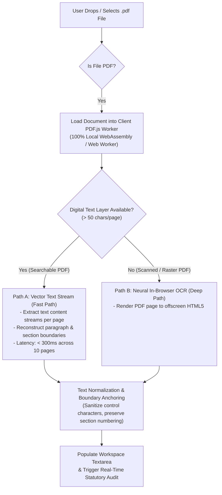

# Roadmap: BillOfRightsBot for Subscriptions ⚖️

> **Repository**: [`knowthankyew/bill-of-rights-bot`](https://github.com/knowthankyew/bill-of-rights-bot)  
> **Status**: **v1.1.0 In-Browser PDF Ingestion & Hybrid OCR Delivered ✅**

---

## Delivered: v1.0.0 Foundation & Core Auditor ✅

The baseline statutory audit studio is fully built, statically verified, and running 100% locally in the browser:

- [x] **Air-Gapped Ingestion & Evaluation**: Zero server backend. Terms text, clauses, and consumer inputs are processed entirely in-memory with zero outbound network calls and zero cloud egress.
- [x] **Statutory Rule Grounding**: Deterministic rule engine evaluating against:
  - **FTC Negative Option / Click-to-Cancel Rule** (16 CFR Part 425 & 15 U.S.C. § 8403 ROSCA)
  - **California Automatic Renewal Law** (Cal. Bus. & Prof. Code §§ 17600–17606, AB 390 & AB 2863)
  - **New York Automatic Renewal Law** (N.Y. Gen. Bus. Law § 527-a)
  - **Illinois Automatic Renewal Act** (815 ILCS 601)
  - **Colorado Consumer Protection Act** (Colo. Rev. Stat. § 6-1-732)
  - **Delaware Auto-Renewal Protections** (Del. Code Ann. tit. 6, § 2734)
- [x] **100% Local In-Browser Photo OCR**: Vendored Tesseract.js LSTM neural engine in WebAssembly running inside an isolated Web Worker (`/public/ocr/`). Ingests physical contract photos (`.png`, `.jpg`, `.jpeg`, `.webp`, `.bmp`) with real-time recognition progress tracking.
- [x] **Actionable Remedy Studio**: Automated generation of:
  - Immediate Click-to-Cancel Demands (16 CFR § 425.6 parity mandate)
  - Pre-formatted FTC & State AG Complaint Drafts
  - California Unconditional Gift Restitution Notices (Cal. Bus. & Prof. Code § 17603)
- [x] **Amnesiac Burn Local Data**: One-click nuclear purge instantly zeroing in-memory buffers, parsed clauses, active DOM nodes, session storage, and terminating OCR worker threads.
- [x] **Non-Blocking Local Sidecar Support**: Probes local inference endpoints (`event-driven-ftaas` or Ollama at `localhost:8000` / `localhost:11434`) with a strict 250ms fail-silent timeout.
- [x] **Day-1 WCAG AA Accessibility**: High-contrast obsidian token system, keyboard operability, and screen-reader announcements.

---

## Milestone 1: In-Browser PDF Ingestion & Hybrid OCR (`v1.1.0`) 🎯 (Next Up)

### Problem Statement: The "Greyed-Out PDF" Bottleneck

PDF is the universal standard for consumer contracts: gym agreements, software licenses, equipment leases, telecom terms of service, and signed disclosures are overwhelmingly distributed as `.pdf` files. 

Currently, PDF files are **greyed out** in the file picker because the input filter only accepts text and raw image formats (`accept=".txt,.md,.html,.htm,.rtf,image/*..."`). If dropped into the workspace, the fallback `FileReader.readAsText()` reads binary PDF bytecode as corrupted characters. Consumers are forced to manually copy-paste multi-page text or take screenshots of their screens to run the existing image OCR.

### The Solution: Zero-Egress In-Browser PDF Ingestion Engine

Provide first-class, drop-in PDF ingestion directly in the browser with **zero cloud dependencies**, using a hybrid **dual-path extraction architecture**:



### Key Technical Specifications for v1.1.0

- [x] **Dual-Path PDF Pipeline**:
  - **Fast Path (Digital/Searchable PDFs)**: In-browser text stream extraction using a vendored, air-gapped `pdfjs-dist` worker. Extracts embedded fonts and text elements in milliseconds without rendering overhead.
  - **Deep Path (Scanned/Flattened PDFs)**: Offscreen `<canvas>` page rasterization feeding directly into the existing vendored WebAssembly OCR worker (`/ocr/worker.min.js`). Handles camera scans, flattened mobile agreements, and signed paper contracts.
  - **Adaptive Auto-Detection**: Heuristic threshold evaluating extracted characters per page. If a page yields `< 50` characters of legible text, seamlessly delegates that page to the neural OCR worker.
- [x] **Multi-Page Lifecycle & Memory Safeguards**:
  - **Page-by-Page Progress Reporting**: Interactive progress indicator displaying current page, extraction phase, and percentage (`"Page 2 of 4: Extracting digital text..."` or `"Page 3 of 4: Local OCR recognizing text (62%)..."`).
  - **Safety Page Cap & Pagination**: Enforce a default ceiling of 20 pages per document to prevent browser tab out-of-memory (OOM) faults on massive enterprise filings, with a 1-click `"Analyze Next 10 Pages"` affordance.
  - **Immediate Frame Cleanup**: Explicitly release `PDFDocumentProxy`, page handles, and offscreen canvas buffers as each page finishes to maintain a minimal memory footprint.
- [x] **Workspace UX & File Chooser Integration**:
  - Update file input filter to `accept=".pdf,application/pdf,.txt,.md,.html,.htm,.rtf,image/*,.jpg,.jpeg,.png,.webp,.bmp"`.
  - Update upload button copy to: `"Upload Document (.pdf, .txt, .md, .html)"`.
  - Add visual mode chip in the input header indicating ingestion provenance: `[PDF Text Stream]` vs `[PDF Local OCR]`.
- [x] **Air-Gap & Amnesiac Conformance**:
  - Zero network dispatch: PDF.js worker scripts and fonts vendored strictly within `/public/pdfjs/` or compiled into the client bundle.
  - Nuclear Amnesia hook: `terminateOcrWorker()` and "Burn Local Data" explicitly flush active PDF byte buffers and canvas allocations.

---

## Milestone 2: Universal Extension Handoff Receiver (`v1.2.0`)

Connect `bill-of-rights-bot` with the `knowthankyew-extension` browser extension via the **Structured Handoff Protocol**:

- [ ] **`useKTYHandoff()` Receiver**: Listen for `KTY_HANDOFF_PAYLOAD` in `sessionStorage` containing pre-scanned checkout domains, detected trap findings, and primary legal links.
- [ ] **Intake Bypass**: When launched from the browser extension's "Get Help / Dispute" action, skip manual document input and load findings directly into the Scorecard.
- [ ] **Auto-Drafted Remedies**: Immediately populate the Remedy Studio with the domain name, detected violation dates, and applicable state statutes extracted during the extension's live page scan.
- [ ] **Cross-Context Amnesia**: Subscribe to `BroadcastChannel('kty_hard_burn')` so nuclear amnesia triggered from the extension or options dashboard immediately clears `sessionStorage` in open tool tabs.

---

## Milestone 3: Expanded Jurisdictions & Statutory Upkeep (`v1.3.0`)

Broaden statutory coverage to cover emerging state automatic renewal laws and international consumer protection baselines:

- [ ] **State ARL Expansion**:
  - **Virginia Consumer Protection Act** (Va. Code Ann. § 59.1-207.46 et seq.)
  - **Washington State Auto-Renewal Law** (Wash. Rev. Code § 19.385.020)
  - **Texas Deceptive Trade Practices Act (DTPA)** auto-renewal amendments
- [ ] **International Policy Compendium**:
  - **UK Digital Markets, Competition and Consumers Act 2024 (DMCC)**: 14-day pre-renewal cooling-off reminder windows and mandatory termination ease.
  - **EU Consumer Rights Directive (Directive 2011/83/EU)**: Strict bans on pre-checked boxes and right-of-withdrawal waivers.
- [ ] **Automated Legislative Monitor Integration**: Connect policy pack definitions to the centralized statutory update crawler to generate review diffs when rule dockets amend.

---

## Milestone 4: Local Neural Assistant & Tailored Notices (`v1.4.0`)

Leverage on-device generative AI to tailor dispute notices with transaction-specific facts:

- [ ] **Chrome Prompt API Integration (`ai.languageModel` / Gemini Nano)**:
  - On-device parameter extraction (subscription price, renewal frequency, trial expiration date, merchant contact address) from ingested PDF text.
  - Zero-egress plain-language translation of convoluted legal arbitration and renewal clauses.
- [ ] **Local Loopback LLM Acceleration**:
  - Enhanced support for `event-driven-ftaas` and Ollama models (`llama3.2`, `mistral`) for high-fidelity extraction on Firefox and Safari.
- [ ] **Customized Notice Export**:
  - 1-click legal PDF export formatted with official formal legal correspondence styling, statutory citations, and certified mail address blocks.

---

## Architecture Deep Dive: Client-Side In-Browser PDF & OCR Engine

### Why Pure In-Browser PDF Processing Is Non-Trivial

Standard web applications offload PDF processing to cloud servers (e.g. AWS Textract, Google Cloud Vision, or headless PDF unbundlers). Because `knowthankyew` operates under an uncompromising **Zero Cloud Ingestion & Air-Gap Guarantee**, all PDF processing must run entirely on the client:

1. **Format Bifurcation**: Modern PDFs are divided into digital PDFs (containing embedded vector font glyphs and structured text streams) and raster PDFs (scanned physical pages or flattened bitmaps containing zero embedded text). A single monolithic parser cannot handle both efficiently.
2. **Memory Constraints**: High-resolution scanned PDF pages (300 DPI) rendered to uncompressed HTML5 canvas elements consume ~33MB of raw RAM per page ($2550 \times 3300 \times 4$ bytes). Without careful memory paging and canvas recycling, multi-page PDFs can crash the browser tab.
3. **CSP & Air-Gap Rigor**: Many popular PDF and OCR libraries attempt to dynamically fetch worker scripts or language models from third-party CDNs (unpkg, cdnjs) at runtime. All PDF.js workers, WebAssembly binaries, and Tesseract language files must be strictly vendored locally and served with `connect-src 'none'`.

### The Dual-Path Ingestion Pipeline

```
                              [ User drops .pdf file ]
                                         │
                                         ▼
                             [ Read ArrayBuffer (Local) ]
                                         │
                                         ▼
                          [ pdfjsLib.getDocument() ]
                                         │
                  ┌──────────────────────┴──────────────────────┐
                  ▼                                             ▼
          Page has text layer?                          Page is scanned image?
        (str.length >= 50 chars)                       (str.length < 50 chars)
                  │                                             │
                  ▼                                             ▼
        [ Path A: Fast Path ]                         [ Path B: Deep Path ]
    Extract textContent items                    Render viewport to OffscreenCanvas
    Rebuild paragraphs & whitespace              Pipe ImageData to Tesseract WASM
    Execution: ~15ms / page                      Execution: ~800ms / page
                  │                                             │
                  └──────────────────────┬──────────────────────┘
                                         ▼
                           [ Concatenate Page Text ]
                                         │
                                         ▼
                           [ Free Page & Canvas Memory ]
                                         │
                                         ▼
                         [ Execute Statutory Rule Engine ]
```

### Memory Management Invariant

- Every rendered `<canvas>` element must have its width and height set to `0` and its 2D context cleared immediately following OCR ingestion.
- `PDFPageProxy.cleanup()` and `PDFDocumentProxy.destroy()` must be invoked synchronously upon document completion or error.
- All PDF buffers are tracked in the ephemeral memory registry and instantly zeroed out when the user clicks **"Burn Local Data"**.

---

*Roadmap and technical architecture maintained by the `knowthankyew` project. Grounded in consumer protection statutes and verified air-gapped local computing.*
